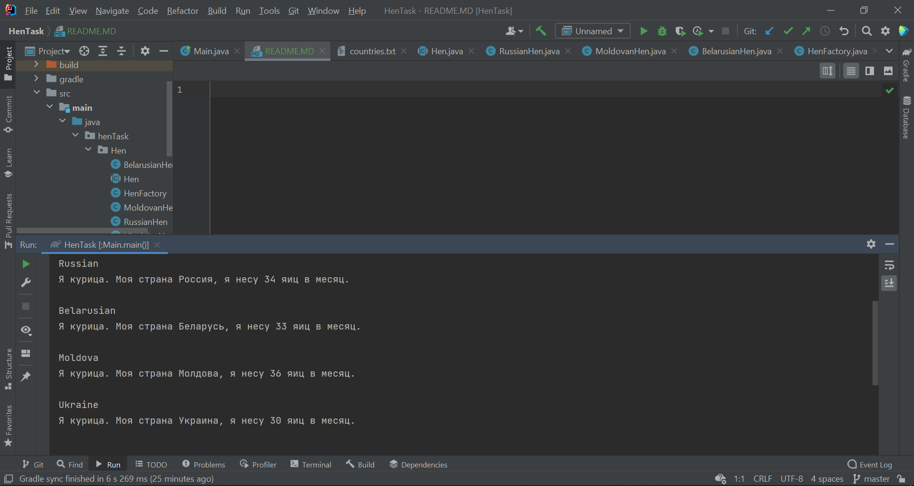

Из файла countries.txt поочередно считываются страны, после чего для каждой страны происходит выполнение кода соответсвующего класса. Пример вывода ниже: 

Считываются только те страны, которые указаны в файле. Т.е если удалить часть стран, то они не появятся в консоли.